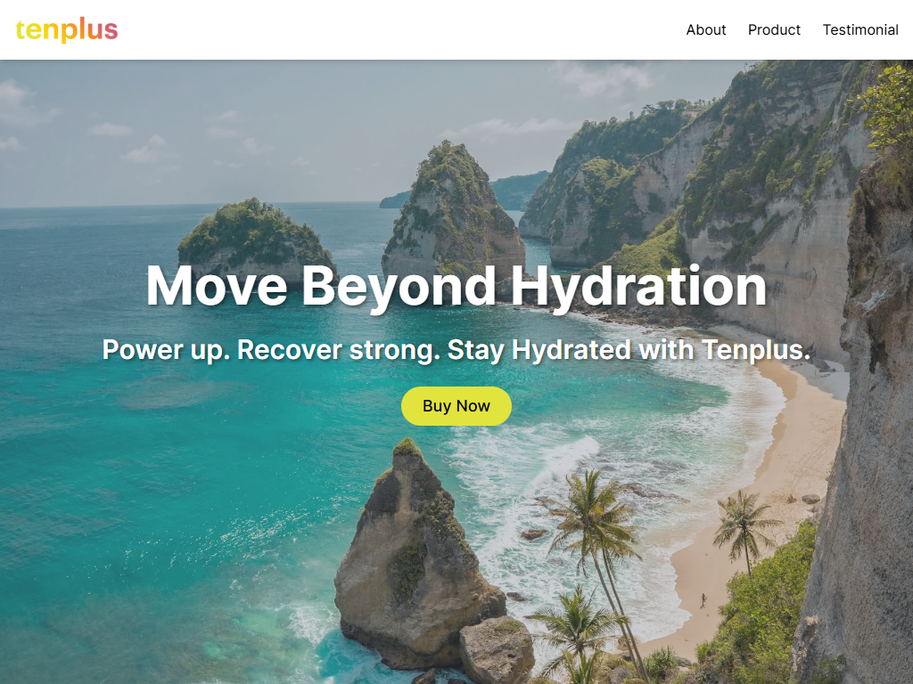

# Tenplus Landing Page

A modern and responsive landing page built with **React**, **JavaScript**, and **Tailwind CSS** for **Tenplus**, a hydration-focused product brand powered by natural phytonutrients.



## 🚀 Live Demo

[🌐 View Live Demo](https://tenplus-seven.vercel.app/)

---

## 📦 Tech Stack

- ⚛️ React + Vite
- 🎨 Tailwind CSS
- 💻 JavaScript

---

## 🧩 Features

- Fully responsive web design across all devices
- Video testimonial carousel
- Responsive header with animated mobile nav
- Footer with navigations, contact, and newsletter email register form

## 🛠️ Getting Started

### 1. Clone the Repository

```
git clone https://github.com/your-username/tenplus-landing-page.git
```

```
cd tenplus-landing-page
```

### 2. Install Dependencies

```
npm install
```

### 3. Run the Development Server

```
npm run dev
```
